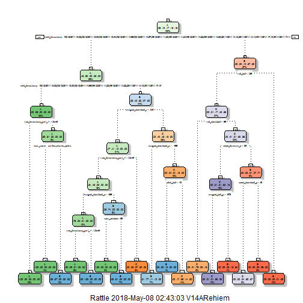

#Overview

The goal of your project is to predict the manner in which they did the exercise. This is the "classe" variable in the training set. You may use any of the other variables to predict with. You should create a report describing how you built your model, how you used cross validation, what you think the expected out of sample error is, and why you made the choices you did. You will also use your prediction model to predict 20 different test cases.


###Reading & Cleaning the Data

```r
set.seed(1234)
library(caret)
library(rpart)
library(rattle)
library(rpart.plot)

trainingData <- read.csv('pml-training.csv')
testingData_Quiz <- read.csv('pml-testing.csv')
dim(trainingData)
```

```
## [1] 19622   160
```

```r
dim(testingData_Quiz)
```

```
## [1]  20 160
```

```r
#Remove the X col as it was only a sequence 
trainingData<-trainingData[,-1]
testingData_Quiz<-testingData_Quiz[,-1]

NZV <- nearZeroVar(trainingData, saveMetrics = TRUE)
#Col which will be removed from Near Zero Value 
head(NZV[NZV$nzv==T,])
```

```
##                       freqRatio percentUnique zeroVar  nzv
## new_window             47.33005    0.01019264   FALSE TRUE
## kurtosis_roll_belt   1921.60000    2.02323922   FALSE TRUE
## kurtosis_picth_belt   600.50000    1.61553358   FALSE TRUE
## kurtosis_yaw_belt      47.33005    0.01019264   FALSE TRUE
## skewness_roll_belt   2135.11111    2.01304658   FALSE TRUE
## skewness_roll_belt.1  600.50000    1.72255631   FALSE TRUE
```

```r
trainingData <- trainingData[, !NZV$nzv]
testingData_Quiz <- testingData_Quiz[, !NZV$nzv]

#Remove NA 
colwithNA <-colSums( is.na( trainingData ) ) > 0
trainingData <-trainingData[,!colwithNA]
testingData_Quiz <-testingData_Quiz[,!colwithNA]
dim(trainingData)
```

```
## [1] 19622    58
```

###Get Train/test Data 

```r
Train <- createDataPartition(y=trainingData$classe, p=0.75, list=FALSE)
training <- trainingData[Train,] 
testing <- trainingData[-Train, ]
```

###using Decision Tree as the algorithms 

```r
mod_DT <- rpart(classe ~ ., data=training, method="class")
fancyRpartPlot(mod_DT)
```



```r
Prediction <- predict(mod_DT, testingData_Quiz, type = "class")


Prediction
```

```
##  1  2  3  4  5  6  7  8  9 10 11 12 13 14 15 16 17 18 19 20 
##  B  A  C  A  A  E  D  C  A  A  B  C  B  A  E  E  A  B  B  B 
## Levels: A B C D E
```
